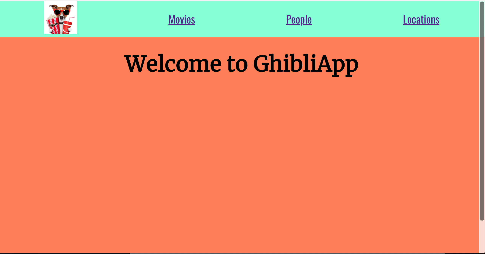
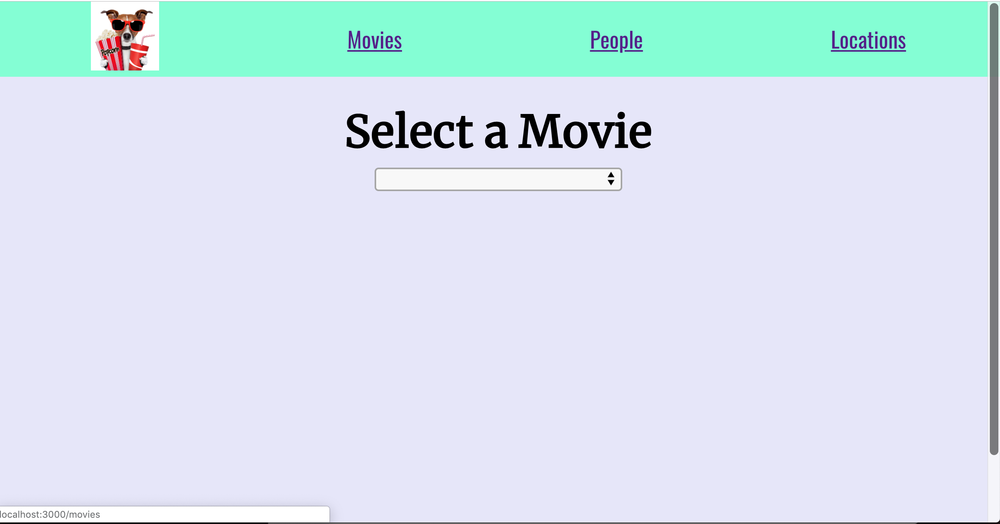
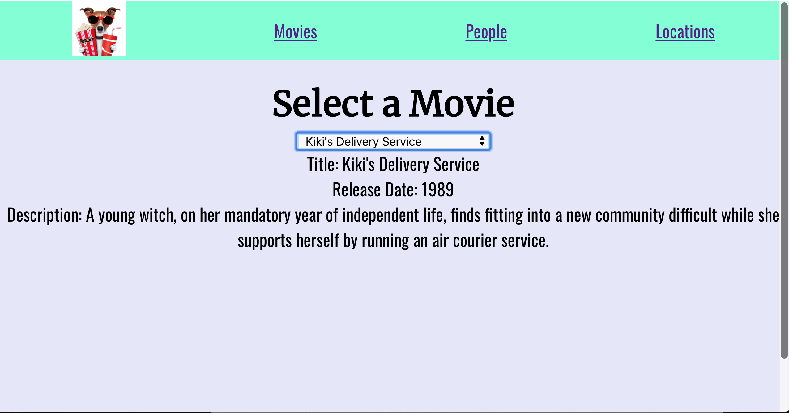
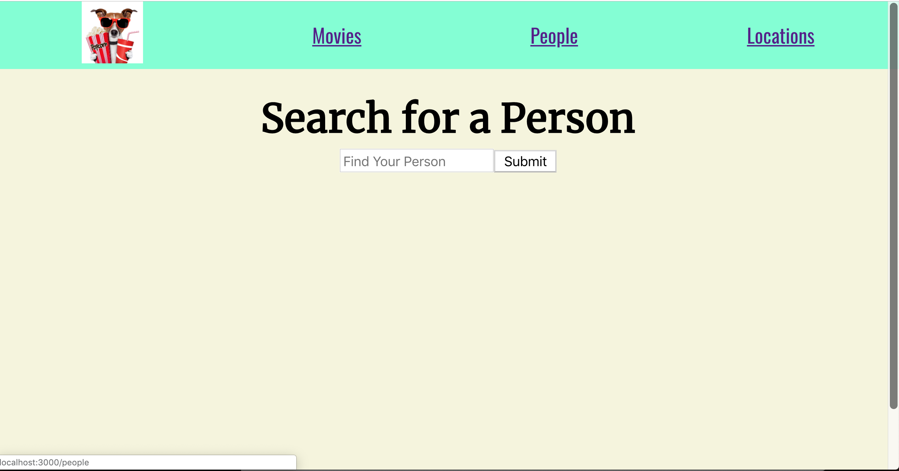
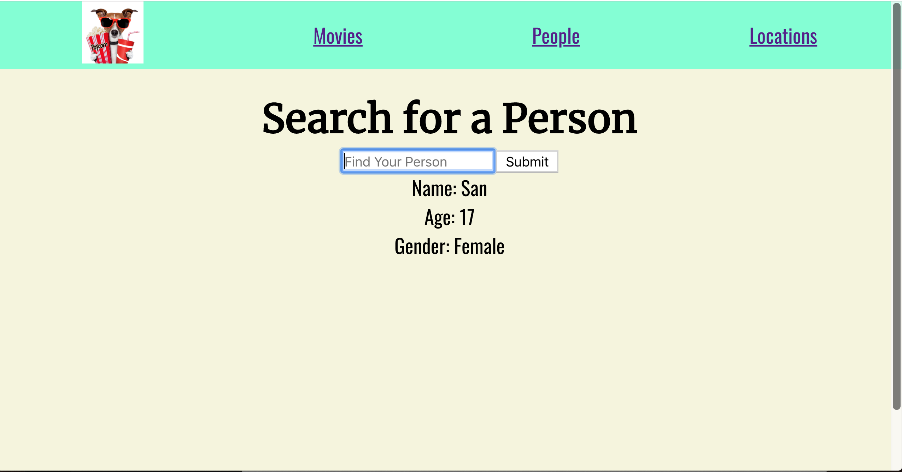
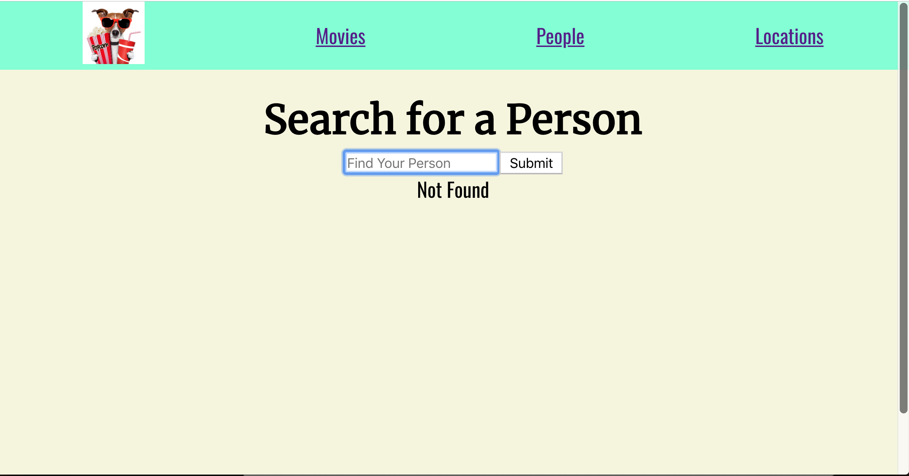
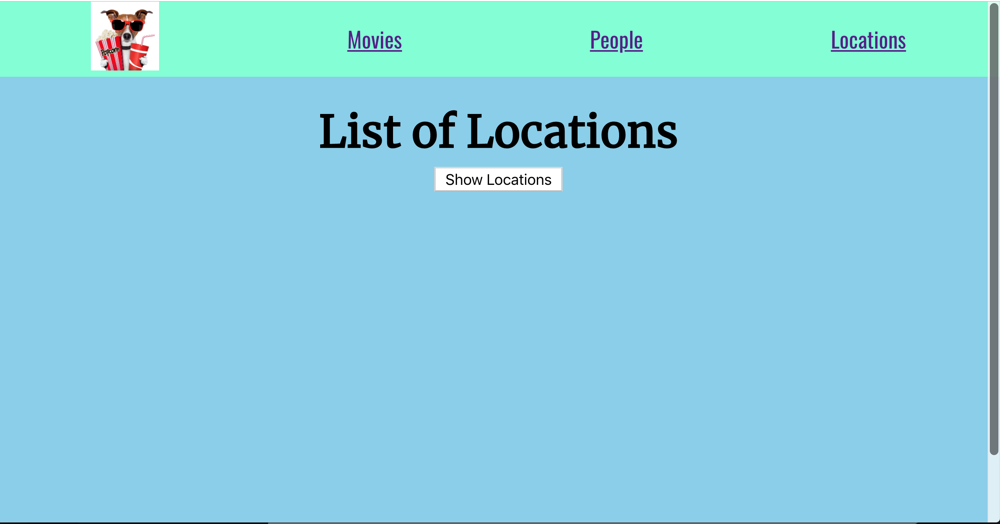
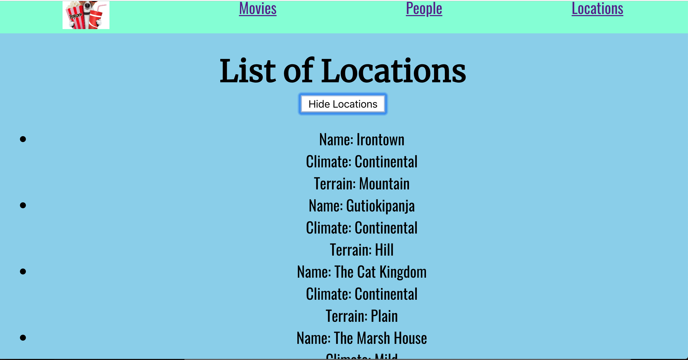

# Module Three Final Assessment

## Getting Started

- Fork this repo
- Clone the forked repository
- `cd` to the directory where you cloned it
- `npm install` to install dependencies
- `npm run cypress` to open the cypress testing window
- `npm test` to run jest / node tests

> _Note_: Remember to `git add`, `git commit` and `git push` regularly

Using the [Studio Ghibli API](https://ghibliapi.herokuapp.com/), you are going to create a frontend-only app.

#### Nav Bar
At the top of your app you should have a navigation bar.

* It displays links to each primary route ("/movies", "/people", "/locations") at the top of the page, in a row, centered.

* Includes a logo of your choosing (50px x 50px), displayed in the upper-left of the page.
The logo and links should display on every page.
The logo should link to the homepage ("/").

Your app should also include the following routes:

### `/`
Includes a centered header with the text "Welcome to GhibliApp". 

### `/movies`
Displays the header "Select a Movie" above a dropdown menu, in the upper ~400px of the page, centered.
The dropdown menu should display a list of the titles of each movie in the database. The first item in the dropdown menu should be blank.
When a movie is chosen from the dropdown menu, the title, release date, and description of that movie should display below it.
In this route, there should be no "Submit" button. Selection from the dropdown menu should submit the user's input automatically.
New inputs should replace the previously displayed information. When 'blank' is selected the movie info should clear off the screen.

### `/people`
Displays the header "Search for a Person" above a text input with a "Search" button, in the upper ~400px of the page, centered.
When a user inputs text and presses "Search", the name, age, and gender, of the character should appear below. **Bonus:** *Include the film/s (by name and any other fun info) that the character appears in.* 
This input should be case-insensitive. The input will accept a full name (no need for partial matches). If the user's input does not match a name (misspelled or otherwise), the text "Not Found" should display below the input.
The input should clear once the "Search" button is pressed.
It's OK if the age or gender of the character is "N/A".
New inputs should replace the previously displayed information.

### `/locations`
Displays a header, centered on the page, with the text "List of Locations".
Display a button that toggles back and forth between "Show Locations" and "Hide Locations". When show locations has been selected, it
displays an unordered list of all of the locations stored in the Ghibli API, centered on the page.
Each location should include the name, climate, and terrain of that location. If the climate or the terrain are "TODO" in the API response, you should replace "TODO" with "Unknown".

Afterwards, you should work on styling:

Import two fonts (of your choosing) from Google Fonts. The first font should be the font you use for header text and the second one should be for input/body/search result text.
Define unique colors (of your choosing) for each page's background.

Remember to install your packages correctly so that we will be able to run / compile your app by running npm install, npm start.

Your app should also have a **clean** console. We don't want to see you Warnings, Errors, or Logs. 

When you are finished, please delete your node_modules folder, change the folders name to firstName_lastName (use your names!), zip the folder, and then upload your app to canvas.
